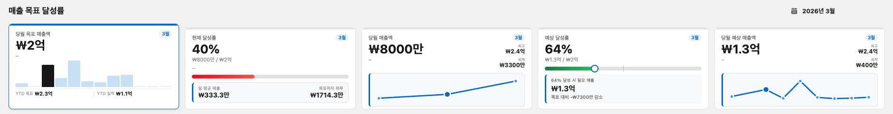

# Sales Dashboard LWC — 구현 기록

> 기획일: 2026-03-20 | 최종 배포: 2026-03-25 | 출처: [Notion](https://www.notion.so/3291241404c38117b2d2f17a5a02dfd1)

---

## 개요

Tableau CRM Analytics에서 영감을 받아 **별도 라이선스 없이** Salesforce 내에서 동작하는
매출 목표 달성률 대시보드 LWC 컴포넌트. Apex + LWC Standard만 사용.



> 캡처 속 고객사 정보는 잘라내거나 가렸다.

**계기:** Tableau CRM Analytics의 KPI 카드 인터랙션에서 영감을 받았다. 카드 안에 미니 차트가 내장되어 있고,
그 차트를 클릭하면 전체 데이터가 동적으로 바뀌는 UX가 인상적이었다. 이걸 Apex + LWC만으로도 구현할 수 있을 것 같았다.

**문제 인식:** 영업 팀이 매출 현황을 보려면 보통 리포트/대시보드를 쓰거나 Tableau CRM 라이선스를 별도로 구매해야 한다.
하지만 Standard Opportunity 데이터만으로도 핵심 지표는 충분히 계산 가능하고, LWC로 인터랙티브하게 만들면 더 빠르게 확인할 수 있다.

**설계 원칙:**
- 어떤 도메인에서도 배포 가능한 Standard LWC — App Page, Record Page, Experience Cloud 전부 가능
- Custom Field / Custom Object 없음 — Standard Field 9개만 사용, 어떤 Org에서든 즉시 동작
- 드롭다운 필터 없음 — 카드 안 미니 차트(바/스파크라인)를 직접 클릭해서 월 변경
- SLDS2 디자인 시스템 기반 UI
- Apex 1회 호출, 이후 월 변경·Stage 필터는 모두 JS 클라이언트 처리

---

## 사용 오브젝트 & 필드

- **Opportunity:** `Amount`, `CloseDate`, `StageName`, `Probability`, `IsWon`, `IsClosed`, `AccountId`, `Name`
- **Account:** `Id`, `Name` (Opportunity 크로스 오브젝트 조회)

---

## KPI 5가지

| 카드 | 지표 | 계산식 |
|---|---|---|
| ① | 당월 목표 매출액 | IsWon=true 또는 IsClosed=false인 Opp Amount 합계 |
| ② | 현재 달성률 | Closed Won ÷ 전체 Opp × 100 |
| ③ | 당월 매출액 | IsWon=true Amount 합계 |
| ④ | 예상 달성률 | (Won + 가중예상) ÷ 전체 Opp × 100 |
| ⑤ | 당월 예상 매출액 | Won + Σ(Amount × Probability/100) for Open |

> Stage 하드코딩 없이 Probability 필드값만 참조 → 커스텀 Sales Process에서도 정확 동작

### KPI 설계 검토 (2026-03-24)

| 카드 | 표시 명칭 | 실제 의미 | 비고 |
|---|---|---|---|
| ① | 당월 목표 매출액 | 이번 달 전체 Opp Amount 합계 (Won + Open) | "목표"가 아닌 파이프라인 총액 |
| ② | 현재 달성률 | Closed Won ÷ 전체 Opp | 클로징률에 가까운 지표 |
| ③ | 당월 매출액 | Closed Won Amount | ②의 분자와 동일 정보 |
| ④ | 예상 달성률 | (Won + 가중예상) ÷ 전체 Opp | ⑤의 비율 표현 |
| ⑤ | 당월 예상 매출액 | Won + Probability 가중합 | ④의 분자와 동일 정보 |

**한계 인식:** "당월 목표 매출액"은 실제 외부 Quota가 아니다. Opportunity Amount 합산값이라 담당자가 Opp를 추가/삭제하면
목표와 달성률이 함께 변한다. 진정한 Quota 기반 달성률을 재려면 Forecast 오브젝트 또는 커스텀 오브젝트가 필요하다.

**결정:** Standard 필드만 사용하는 설계 원칙을 지키되 한계를 인지하고 유지. 파이프라인 클로징 관리 도구로서의 가치는 충분하다.

---

## 이득

**학습 관점**
- Apex Wrapper Class 설계 및 데이터 가공 패턴
- LWC `@wire` vs imperative call 차이와 사용 시점
- LWC Custom Event로 컴포넌트 간 통신 (단방향 데이터 흐름)
- SVG 기반 미니 차트 직접 렌더링 (외부 라이브러리 없이)
- SLDS2 디자인 시스템 적용

**실무 관점**
- Tableau CRM 라이선스 없이 비슷한 수준의 매출 인사이트 제공
- Standard 필드만 쓰기 때문에 어떤 고객사 Org에도 즉시 배포 가능한 재사용 컴포넌트
- 월별 트렌드를 드릴다운 없이 카드 하나에서 바로 파악

---

## 컴포넌트 구성

### salesDashboard (메인)
- `salesDashboard.js` / `.html` / `.css` / `.js-meta.xml`
- `SalesDashboardController.cls`

### salesDashboardModal (2026-03-25 추가)
카드 클릭 시 `lightning-modal`로 확대 뷰. 해당 월 관련 Opportunity 목록 표시.

| 파일 | 역할 |
|---|---|
| `salesDashboardModal.js` | `LightningModal` 확장. `@api`: cardIndex, yearMonth, kpiSnapshot, opportunities |
| `salesDashboardModal.html` | header(제목+연월) / body(KPI 값 + Opp 테이블) / footer(닫기) |
| `salesDashboardModal.css` | 36px KPI 메인 값, 테이블 스타일, empty state |
| `salesDashboardModal.js-meta.xml` | `isExposed: false` |

**데이터 흐름:** 추가 Apex 호출 없음. 이미 로드된 연도 전체 데이터에서 클라이언트 사이드 필터링.
`kpiSnapshot`은 `JSON.parse(JSON.stringify(this.kpi))`로 deep clone — 모달 열린 후 부모 상태 변경 격리.

---

## 래퍼 카드 스타일 (2026-03-25)

```css
.sd-wrapper {
    background: #fff;
    border-radius: 8px;
    border: 1px solid #e5e5e5;
    box-shadow: 0 2px 8px rgba(0, 0, 0, 0.08);
}
```

---

## 코드 리뷰 기반 버그 수정 (2026-03-25)

### Critical (3건)

| # | 이슈 | 수정 |
|---|---|---|
| 1 | Apex FLS 미적용 | Dynamic SOQL에 `WITH USER_MODE` 추가 |
| 2 | 카드 deselect 시 모달 재오픈 | `handleCardClick`에 `isNowSelected` 가드 추가 |
| 3 | 드래그 핸들 클릭 버블링 | `event.stopPropagation()` 처리 |

### Important (2건)

| # | 이슈 | 수정 |
|---|---|---|
| 4 | 모달 금액 하드코딩 KRW | 부모에서 `_fmtCurrency()` pre-format 후 `amountFormatted`로 전달 |
| 5 | `_fmtDate` 연도 누락 | `M/DD` → `YYYY/M/DD` 형식으로 수정 |

---

## 배포

**Status: Succeeded** — 10개 파일 전체 배포 완료 (2026-03-25)
- `salesDashboard` (js, html, css, js-meta.xml)
- `salesDashboardModal` (js, html, css, js-meta.xml) — 신규
- `SalesDashboardController` (cls, cls-meta.xml)

---

## 회고

**시도한 것:**
- SVG 스파크라인 직접 렌더링 (polyline + area gradient + dot)
- 예상 달성률 drag 슬라이더 인터랙션 (delta 기반 계산)
- 카드 클릭으로 월 선택, 바 차트 클릭으로 월 변경
- 일 평균 매출 / 목표까지 하루 필요 매출 클라이언트 계산

**실패 → 해결:**
- 드래그 200%에서 고정 버그 → `_dragStartX` + `_dragStartRate` delta 방식으로 해결
- SVG 차트 하단 여백 → viewBox `0 0 200 40`으로 통일
- 카드 높이 불균일 → `sd-card-body` padding 축소 + 여백 조정
