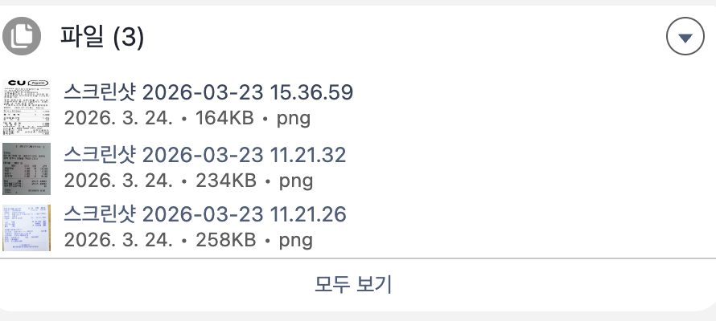
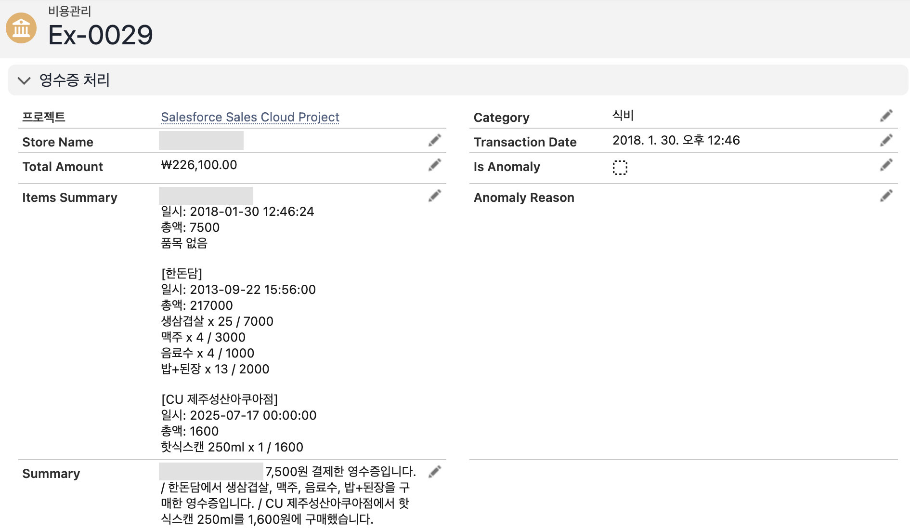

# 영수증 AI 자동 처리 시스템 — 아키텍처 & 구현 회고

> 작성일: 2026-03-23 | 출처: [Notion](https://www.notion.so/32c1241404c380e0936cd6aef24fc149)

---

## 개요

출발점은 단순했다. 영수증을 사람이 직접 보고 상호명·날짜·금액·품목을 수기로 입력하는 과정이 번거롭고,
여러 장을 한 번에 관리하기도 불편했다.

> **목표: 영수증 이미지를 AI가 읽고, Salesforce 비용 레코드에 자동으로 반영되게 만들자**

처음에는 "영수증 OCR 자동화"에 가까운 문제로 시작했지만, 진행해보니 단순 OCR보다 더 중요한 건
**업무 흐름에 맞는 구조화**였다. 지금은 **여러 영수증을 하루 단위 비용으로 해석하고, 분류·요약·이상 탐지까지 수행하는 AI 기반 비용 분석 시스템**이다.

초기 목표는 3단계였다.

1. **영수증 이미지에서 데이터 추출** — 상호명 / 거래일시 / 총액 / 품목 목록
2. **Salesforce와 연동** — Expense 레코드에 자동 반영 (필요하면 Expense_Item 생성)
3. **사용자 개입 최소화** — 파일 업로드 또는 버튼 클릭만으로 처리

---

## 왜 Vertex AI (Gemini)인가

영수증은 이미지 기반이고, 가게마다 레이아웃이 제각각이며, 한국어/영어 혼재·손글씨·인쇄 품질 차이 등 변수가 많다.

- **단순 OCR:** 텍스트 추출은 되지만 "이게 상호명인지, 금액인지, 날짜인지" 구분 불가
- **규칙 기반 파싱:** 레이아웃이 조금만 달라도 실패 → 유지보수 비용 폭증
- **수기 입력:** 오기/누락 발생

| 기준 | 이유 |
|---|---|
| 멀티모달 지원 | 이미지를 직접 입력으로 받아 분석. 별도 OCR 단계 불필요 |
| 구조화된 출력 | 프롬프트로 JSON 스키마를 지정하면 상호명/날짜/금액/품목을 정형 데이터로 반환 |
| 한국어 영수증 인식 | 한/영 혼재, 다양한 폰트/레이아웃에 강건 |
| GCP 생태계 통합 | Cloud Run + Vertex AI = 동일 프로젝트 IAM 인증, 별도 API Key 불필요 |
| 유연한 프롬프트 | 필드 누락 시 null, 날짜 포맷 통일 등 예외 처리를 프롬프트로 제어 |

> 핵심은 **"이미지를 이해하고 구조화하는 능력"**. 맥락을 파악해서 데이터를 정형화하는 것이 Gemini를 고른 이유.

---

## 전체 처리 흐름

```
Salesforce (Apex)
  → 이미지 파일을 Base64로 인코딩
  → Cloud Run (Python / FastAPI)
      → Vertex AI Gemini 멀티모달 호출 (asyncio.gather 병렬 처리)
          → 영수증 이미지 분석
          → JSON 구조로 반환
            { store_name, transaction_date, total_amount, items[],
              category, summary, is_anomaly, anomaly_reason }
  → Apex에서 JSON 파싱
  → Expense__c 필드 업데이트
```

---

## 설계 전환점

### 구조 1: 영수증 1장 = Expense 1건 (폐기)

영수증 1개 업로드 → AI가 한 장 읽음 → Expense 1건 업데이트 → 품목은 Expense_Item line item 생성.
기술적으로는 정석에 가까웠지만 실제 사용 흐름과 달랐다. 사용자는 하루 동안 여러 장의 영수증을 받고,
그걸 하나의 비용 정산 단위로 보고, 파일 여러 개를 한 Expense에서 관리하고 싶어 했다.

```
Expense = 영수증 1장  ❌  (초기 설계)
Expense = 하루 단위 비용 묶음  ✅  (최종 확정)
```

이 정의가 전체 구조를 바꿨다.

### 구조 2: Trigger 기반 자동 처리 (폐기)

파일 업로드 → Trigger → Queueable → AI 호출 → Expense 업데이트.

- 파일 1개 올릴 때마다 바로 API 호출
- 여러 개를 올리면 중간 상태로 계속 재계산
- 사용자는 "다 올리고 나서 한 번에 처리"하고 싶어 함
- 비용도 불필요하게 늘어남

> **결론: 자동화가 항상 좋은 건 아니다. 이 경우에는 버튼 기반이 더 맞다.**
> 파일을 다 올리고 버튼 클릭 → 1회 batch 처리.

### Expense_Item 구조를 접은 이유

처음에는 line item 구조가 맞다고 봤지만, 사용자는 품목별 레코드를 잔뜩 보고 싶은 게 아니었다.
"이날 비용이 얼마였는지", "무슨 성격의 지출인지"가 더 중요했다.

```
정규화보다 사용성 우선
레코드 폭증보다 요약 중심
```

→ `ItemsSummary__c`에 상세 문자열, `Summary__c`에 한 줄 요약 저장.

---

## 사용자 흐름

1. Expense 생성 (하루 단위 비용 묶음)
2. 영수증 이미지 여러 장 업로드 (png/jpg/jpeg/webp)

   

3. [영수증 처리] 버튼 클릭

   

4. 중복 파일 감지 시 확인 팝업
5. 처리 완료 → 레코드 페이지 자동 이동, 값 즉시 반영

   

   > 캡처의 일부 상호명과 고객사 항목은 가렸다.

---

## Expense__c 필드 구성

| 필드 API명 | 타입 | 용도 |
|---|---|---|
| `TotalAmount__c` | Currency | 전체 영수증 합산 금액 |
| `ItemsSummary__c` | Long Text | 영수증별 품목 요약 |
| `StoreName__c` | Text | 첫 번째 영수증 상호명 |
| `TransactionDate__c` | DateTime | 첫 번째 영수증 거래 일시 |
| `AIProcessed__c` | Checkbox | AI 처리 완료 여부 |
| `RawJSON__c` | Long Text | AI 응답 원본 JSON |
| `Category__c` | Picklist | 비용 성격 (식비/교통비/숙박비/회의비/접대비/소모품비/기타) — AI 분류 후 Picklist 매핑 |
| `Summary__c` | Text | AI 생성 한 줄 요약 (`/` 로 합산) |
| `IsAnomaly__c` | Checkbox | 이상 거래 여부 (하나라도 true면 true) |
| `AnomalyReason__c` | Text | 이상 판단 이유 (`\|` 로 합산) |

---

## 처리 프로세스 상세

1. **사용자:** Expense 생성 → 영수증 이미지 여러 장 첨부 → [영수증 처리] 버튼 클릭
2. **LWC (ReceiptProcessAction):** `checkDuplicateFiles()` → 중복 팝업(취소 or 그래도 진행) → `processExpense()` 호출 (동기)
3. **Apex (ReceiptExtractorService):** 첨부 파일 조회(ContentDocumentLink → ContentVersion) → 지원 이미지만 필터링 → Base64 인코딩 → BatchRequestDTO 구성 → `/extract-receipts-batch` POST 1회
4. **Cloud Run:** `asyncio.gather()`로 파일별 병렬 Vertex AI(Gemini 2.5 Flash) 호출 → JSON 배열 반환
5. **Apex 응답 처리:** `List<ReceiptResponseDTO>` 파싱, 응답 수 ≠ 요청 수면 에러
   - 전체 합산: TotalAmount, ItemsSummary
   - 첫 번째 기준: StoreName, TransactionDate, Category
   - 전체 기준: Summary (`/` 합산), IsAnomaly (하나라도 true면 true), AnomalyReason
   - Expense__c 업데이트
6. **LWC:** `CloseActionScreenEvent` → `NavigationMixin`으로 Expense 레코드 redirect

---

## 성능 이력

| 시점 | 처리 시간 | 조건 |
|---|---|---|
| 2026-03-23 | 5장 약 10초 (파일당 ~2초) | Apex에서 파일별 순차 API 호출 |
| 2026-03-24 | 3장 20초 이상 | 폰 카메라 원본(3~8MB)을 그대로 전송 |
| 2026-03-24 이후 | 5~8초 (예상, 실측 전) | max 1024px 리사이즈 + 배치 엔드포인트 병렬 처리 |

→ 상세: [Cloud Run 성능 개선](cloud-run-performance.md)

---

## 교훈

- **자동화는 항상 좋은 것이 아니다** — Trigger 기반보다 버튼 기반이 더 명확하고 안정적
- **데이터 모델이 가장 중요하다** — Expense = 영수증 1장이 아니라 하루 단위 묶음. 이 정의가 전체 구조를 바꿈
- **정규화보다 사용성 우선** — 세부 품목 레코드화보다 요약 중심이 실무에 적합
- **전체 재계산이 가장 안전하다** — 누적 방식보다 매번 전체 재처리
- **AI는 핵심 엔진** — 단순 보조 도구가 아니라 이 시스템의 핵심

---

## 한 줄 정리

처음에는 영수증 이미지를 Salesforce에 자동 입력하는 기능으로 시작했지만,
지금은 여러 영수증을 하루 단위 비용으로 해석하고 분류·요약·이상 탐지까지 수행하는 시스템이 됐다.
Category / Summary / IsAnomaly / AnomalyReason 구현과 병렬 처리 전환까지 끝났고, 다음 단계는 승인 흐름 연동이다.
